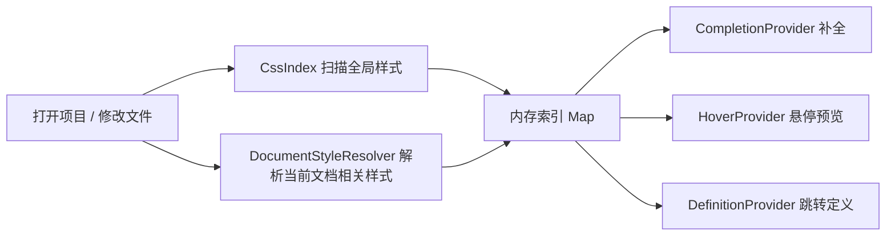

# 插件设计文档 / Architecture

## 1. 这个插件想解决什么问题

这个插件不是做通用 CSS 语言服务，它更像是一个“项目内本地样式索引器”。

核心目标只有三件事：

- 在写模板时，知道项目里已经有哪些 class
- 鼠标悬停 class 时，立刻看到样式内容
- 需要定位时，能跳到当前文件样式、引入样式、全局样式的真实定义位置

也就是说，它关注的是“项目自己的样式资产”，而不是完整模拟浏览器 CSS 引擎。

## 2. 我是怎么拆这个插件的

现在 `src` 目录按职责拆成了几层：

- [extension.js](/E:/myself/localhost-css/src/extension.js)
  入口文件，只负责注册 VS Code provider、命令、监听器。
- [constants.js](/E:/myself/localhost-css/src/constants.js)
  放插件常量，比如支持的文档类型、默认索引范围、默认排除项。
- [css-index.js](/E:/myself/localhost-css/src/css-index.js)
  负责“全局样式索引”。它会扫描工作区，把符合规则的 css/scss/less 解析进内存。
- [document-style-resolver.js](/E:/myself/localhost-css/src/document-style-resolver.js)
  负责“当前文档相关样式”。它会找当前文件里的 `<style>`、当前文件直接引入的样式文件，以及这些样式文件继续依赖的样式。
- [document-context.js](/E:/myself/localhost-css/src/document-context.js)
  负责判断光标是不是落在 class 值里，以及当前 class token 是什么。
- [parsing.js](/E:/myself/localhost-css/src/parsing.js)
  负责把样式文本解析成结构化 entry。
- [presentation.js](/E:/myself/localhost-css/src/presentation.js)
  负责把 entry 转成 hover 展示和补全展示。
- [utils.js](/E:/myself/localhost-css/src/utils.js)
  放去重、排序、聚合、glob 小工具。

这样拆开后，后续你想加功能时，通常都能很快知道应该改哪里。

## 3. 运行时的数据流

整体流程可以理解成下面这条链路：



更具体一点：

1. `CssIndex` 在激活时扫描默认全局样式目录和用户配置目录。
2. 每个样式文件会被 `parsing.js` 解析成多个 entry。
3. 每个 entry 至少包含这些信息：

- `className`
- `selector`
- `filePath`
- `line`
- `column`
- `declarations`
- `contextLabel`
- `sourceKind`

4. 当前编辑文档触发补全、hover、definition 时，会额外调用 `DocumentStyleResolver`。
5. 最终把“当前文件样式 + 引入样式 + 全局样式”合并，再按优先级排序返回给 VS Code。

## 4. 为什么要分成三类样式来源

我这里把来源分成三种：

- `inline`
- `imported`
- `global`

原因很简单：用户最关心的不是“这个类有没有”，而是“这个类在当前页面究竟受谁影响”。

所以我们现在展示顺序是：

1. 当前文件里的 `<style>`
2. 当前文件直接或间接引入的样式
3. 全局样式

这不等于完整 CSS 优先级计算，但对日常开发定位问题已经非常实用，而且实现复杂度还可控。

## 5. hover 和跳转是怎么工作的

### Hover

当鼠标停在 class 上时：

1. `document-context.js` 先判断光标是不是在 class 值里。
2. 如果是，就提取当前 token，比如 `state`。
3. 然后分别从：

- 当前文档相关样式
- 全局样式索引

里查找同名 class。

4. 最后由 `presentation.js` 把结果分组展示成：

- 当前文件样式 / Current File Styles
- 引入样式 / Imported Styles
- 全局样式 / Global Styles

### Definition

跳转定义用的是同一批 entry，只是把每个 entry 的 `filePath + line + column` 转成 `vscode.Location` 返回。

所以它天然支持一个类名对应多个定义位置。

## 6. 为什么之前会出现 hover 和跳转失效

之前最大的问题在于“class 上下文识别太死了”。

老逻辑基本只看当前行，所以一旦出现这种写法：

```html
<div
  class="state active"
/>
```

或者：

```vue
<a-form
  class="margin-top padding-left"
/>
```

光标如果落在换行后的 class token 上，插件就判断不出你还在同一个引号区间里，于是 hover、definition、补全都会一起失效。

现在的修复方式是：

- 不再只看单行
- 改成基于整个文档文本做“向前找 opening quote、向后找 closing quote”的判断
- 再结合 `class` / `className` / `:class` / `clsx()` 等上下文做限制

这样多行模板下稳定性会高很多。

## 7. 为什么要排除 `node_modules` 和打包产物

这个插件的定位是“帮你看自己项目的样式”，不是“把整个依赖树都索引进来”。

如果把这些内容也加进来：

- `node_modules`
- `dist`
- `build`
- `.next`
- `.nuxt`
- `.min.css`
- CSS Modules

会有几个问题：

- 补全噪音很大
- hover 命中很多无关结果
- 索引速度慢
- 内存占用更高

所以默认策略是“偏保守，只索引更可能有价值的本地样式”。

## 8. 如果你以后想继续扩展，建议从哪里下手

几个比较自然的方向：

- 支持更多样式别名解析规则
- 给 hover 增加更清楚的覆盖顺序提示
- 支持更复杂的 Vue / React 动态 class 表达式
- 给设置项增加“项目级预设”
- 增加简单测试，避免回归问题

如果你要加新能力，可以按这个判断：

- 和“文件怎么找”有关：改 [css-index.js](/E:/myself/localhost-css/src/css-index.js) 或 [path-utils.js](/E:/myself/localhost-css/src/path-utils.js)
- 和“样式怎么解析”有关：改 [parsing.js](/E:/myself/localhost-css/src/parsing.js)
- 和“光标位置怎么识别”有关：改 [document-context.js](/E:/myself/localhost-css/src/document-context.js)
- 和“UI 怎么展示”有关：改 [presentation.js](/E:/myself/localhost-css/src/presentation.js)
- 和“当前文件关联样式怎么找”有关：改 [document-style-resolver.js](/E:/myself/localhost-css/src/document-style-resolver.js)

## 9. 你可以把这个插件理解成什么

如果要用一句话概括：

这个插件本质上是一个“面向本地样式资产的轻量索引器 + VS Code 展示层”。

它不是浏览器，不是完整 CSS 解释器，也不是 Tailwind 那种框架级语言服务；它做的是更贴近业务项目日常开发的事：

- 快速找到类
- 快速看到样式
- 快速跳到定义

这也是它最适合长期迭代的方向。
